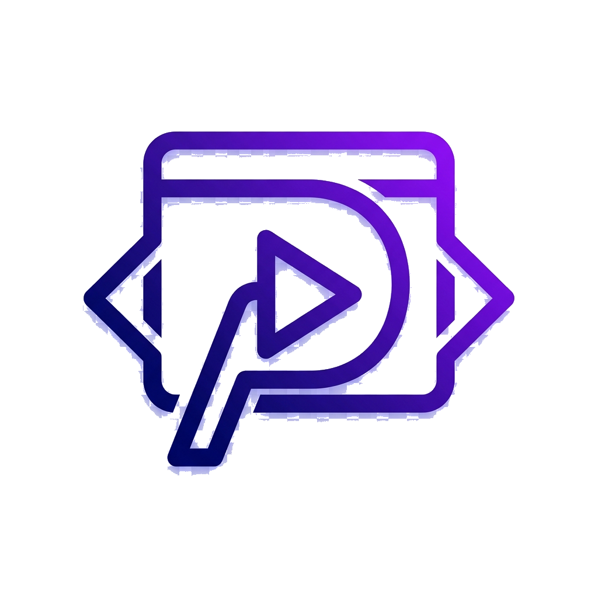

# Playwright Studio

Playwright Studio は、ブラウザ操作の録画、再生、および定期実行を直感的に管理できるモダンな Electron ベースの GUI アプリケーションです。



## 🚀 主な機能

- **操作の録画 (Codegen)**: Playwright の `codegen` 機能をGUIから直接起動し、ブラウザ上での操作をリアルタイムにスクリプト化します。
- **スクリプト管理**: 保存されたスクリプトの一覧表示、編集、削除が可能です。
- **柔軟な再生**: スクリプトを即座に実行。Headless（バックグラウンド）モードと Headed（ブラウザ表示）モードを自由に切り替えられます。
- **スケジュール実行 (Cron)**: Cron 形式で実行スケジュールを設定可能。PCが起動していれば指定した時間に自動でタスクを実行します。
- **システムトレイ連携**:
  - アプリを閉じてもバックグラウンドで動作を継続。
  - トレイメニューから現在実行中のタスクや、次回の実行予定時刻を確認できます。
- **ログのリアルタイム表示**: 実行中のスクリプトの出力を統合コンソールで詳細に確認できます。
- **自動起動設定**: OS ログイン時にアプリを自動的にバックグラウンドで開始する設定が可能です。
- **プレミアムなUI/UX**: ダークモード、グラスモーフィズム、洗練されたアニメーションを採用したモダンなデザイン。

## 📦 インストール

### macOS (Homebrew)

[blue1st/homebrew-taps](https://github.com/blue1st/homebrew-taps) を利用してインストールできます。

```bash
brew install blue1st/taps/playwright-studio
```

### 手動インストール

1. [Releases](https://github.com/blue1st/playwright-gui/releases) ページから最新バージョンのインストーラーをダウンロードします。
   - macOS: `playwright-gui_X.X.X_arm64.dmg` (Apple Silicon) または `playwright-gui_X.X.X_x64.dmg` (Intel)
   - Windows: `playwright-gui_X.X.X.exe`
2. ダウンロードしたファイルを実行してインストールします。

## 🛠 開発者向けセットアップ

### 前提条件

- [Node.js](https://nodejs.org/) (v18 以上推奨)
- npm

### 開発環境の構築

1. リポジトリをクローンまたはダウンロードします。
2. 依存関係をインストールします：
   ```bash
   npm install
   ```
3. Playwright のブラウザをインストールします：
   ```bash
   npx playwright install chromium
   ```

## 💻 開発とビルド

### 開発モードで実行
Vite の HMR (Hot Module Replacement) を有効にしてアプリを起動します：
```bash
npm run dev
```

### ビルド（パッケージ化）
現在のプラットフォーム（macOS/Windows/Linux）向けにインストールファイルを生成します：
```bash
npm run dist:electron
```
ビルドされたファイルは `release/` ディレクトリに出力されます。

## 📂 プロジェクト構造

- `main.js`: Electron メインプロセス。Playwright の操作、スケジューラー、システムトレイ、IPC 通信を制御。
- `preload.cjs`: メインプロセスとレンダラープロセスの安全な橋渡し。
- `renderer.js`: UI ロジックとフロントエンドの制御。
- `style.css`: モダンなスタイリング（Glassmorphism）。
- `recordings/`: 録画されたスクリプト（`.cjs`）が保存されるディレクトリ。
- `package.json`: アプリの構成と依存関係の定義。

## 📜 ライセンス

MIT
